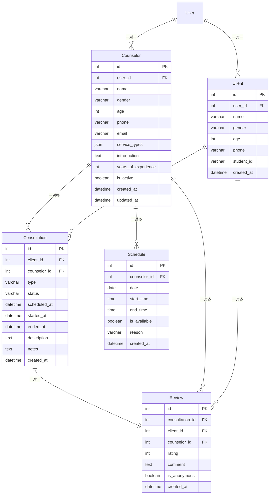

# CounselorApp 数据库表字段文档

## 概述
CounselorApp是咨询师工作台应用，包含咨询师管理、咨询会话、排班管理、评论管理等核心功能。

## 数据表结构

### 1. Counselor（咨询师信息表）

| 字段名 | 类型 | 说明 | 约束 | 默认值 |
|--------|------|------|------|--------|
| id | AutoField | 主键ID | PRIMARY KEY | 自动递增 |
| user | OneToOneField(User) | 关联用户 | CASCADE, related_name='counselor' | - |
| name | CharField(100) | 姓名 | max_length=100 | - |
| gender | CharField(10) | 性别 | choices=GENDER_CHOICES | - |
| age | PositiveSmallIntegerField | 年龄 | validators=[18,70] | - |
| phone | CharField(20) | 手机号 | max_length=20 | - |
| email | EmailField | 邮箱 | - | - |
| avatar | ImageField | 头像 | upload_to='counselor_avatars/' | null=True, blank=True |
| service_types | JSONField | 服务类型配置 | default=list | [] |
| introduction | TextField | 个人介绍 | blank=True | '' |
| years_of_experience | PositiveSmallIntegerField | 从业年限 | default=0 | 0 |
| is_active | BooleanField | 是否激活 | default=True | True |
| created_at | DateTimeField | 创建时间 | auto_now_add=True | 当前时间 |
| updated_at | DateTimeField | 更新时间 | auto_now=True | 当前时间 |

**性别选项 (GENDER_CHOICES):**
- male: 男
- female: 女  
- other: 其他

**服务类型选项 (SERVICE_TYPE_CHOICES):**
- academic: 学业压力
- emotional: 情感咨询
- relationship: 人际关系
- career: 职业规划
- other: 其他

### 2. Client（客户信息表）

| 字段名 | 类型 | 说明 | 约束 | 默认值 |
|--------|------|------|------|--------|
| id | AutoField | 主键ID | PRIMARY KEY | 自动递增 |
| user | OneToOneField(User) | 关联用户 | CASCADE, related_name='client' | - |
| name | CharField(100) | 姓名 | max_length=100 | - |
| gender | CharField(10) | 性别 | choices=GENDER_CHOICES | - |
| age | PositiveSmallIntegerField | 年龄 | validators=[12,30] | - |
| phone | CharField(20) | 手机号 | max_length=20 | - |
| student_id | CharField(20) | 学号 | max_length=20, blank=True | '' |
| created_at | DateTimeField | 注册时间 | auto_now_add=True | 当前时间 |

### 3. Consultation（咨询会话表）

| 字段名 | 类型 | 说明 | 约束 | 默认值 |
|--------|------|------|------|--------|
| id | AutoField | 主键ID | PRIMARY KEY | 自动递增 |
| client | ForeignKey(Client) | 客户 | CASCADE, related_name='consultations' | - |
| counselor | ForeignKey(Counselor) | 咨询师 | CASCADE, related_name='consultations' | - |
| type | CharField(20) | 咨询类型 | choices=CONSULTATION_TYPE_CHOICES | - |
| status | CharField(20) | 状态 | choices=STATUS_CHOICES | 'pending' |
| scheduled_at | DateTimeField | 预约时间 | - | - |
| started_at | DateTimeField | 开始时间 | null=True, blank=True | null |
| ended_at | DateTimeField | 结束时间 | null=True, blank=True | null |
| description | TextField | 问题描述 | blank=True | '' |
| notes | TextField | 咨询笔记 | blank=True | '' |
| created_at | DateTimeField | 创建时间 | auto_now_add=True | 当前时间 |

**咨询类型选项 (CONSULTATION_TYPE_CHOICES):**
- academic: 学业压力
- emotional: 情感咨询  
- relationship: 人际关系
- career: 职业规划
- other: 其他

**状态选项 (STATUS_CHOICES):**
- pending: 待接单
- in_progress: 咨询中
- completed: 已结束
- rejected: 已拒绝

**计算属性:**
- duration: 咨询时长（分钟），当started_at和ended_at存在时计算

### 4. Schedule（排班表）

| 字段名 | 类型 | 说明 | 约束 | 默认值 |
|--------|------|------|------|--------|
| id | AutoField | 主键ID | PRIMARY KEY | 自动递增 |
| counselor | ForeignKey(Counselor) | 咨询师 | CASCADE, related_name='schedules' | - |
| date | DateField | 排班日期 | - | - |
| start_time | TimeField | 开始时间 | - | - |
| end_time | TimeField | 结束时间 | - | - |
| is_available | BooleanField | 是否可用 | default=True | True |
| reason | CharField(200) | 停诊原因 | blank=True | '' |
| created_at | DateTimeField | 创建时间 | auto_now_add=True | 当前时间 |

**唯一约束:**
- unique_together: ['counselor', 'date', 'start_time']

### 5. Review（评论表）

| 字段名 | 类型 | 说明 | 约束 | 默认值 |
|--------|------|------|------|--------|
| id | AutoField | 主键ID | PRIMARY KEY | 自动递增 |
| consultation | OneToOneField(Consultation) | 咨询会话 | CASCADE, related_name='review' | - |
| client | ForeignKey(Client) | 客户 | CASCADE, related_name='reviews' | - |
| counselor | ForeignKey(Counselor) | 咨询师 | CASCADE, related_name='reviews' | - |
| rating | PositiveSmallIntegerField | 评分 | choices=RATING_CHOICES, validators=[1,5] | - |
| comment | TextField | 评论内容 | - | - |
| is_anonymous | BooleanField | 是否匿名 | default=False | False |
| created_at | DateTimeField | 评论时间 | auto_now_add=True | 当前时间 |

**评分选项 (RATING_CHOICES):**
- 1: 1星
- 2: 2星  
- 3: 3星
- 4: 4星
- 5: 5星

## 表关系图

## 索引和排序

**Counselor表:**
- 默认排序: `-created_at`（按创建时间降序）

**Consultation表:**
- 默认排序: `-scheduled_at`（按预约时间降序）

**Schedule表:**
- 默认排序: `date`, `start_time`（按日期和时间升序）
- 唯一约束: `counselor`, `date`, `start_time`

**Review表:**
- 默认排序: `-created_at`（按评论时间降序）

## 数据验证规则

1. **年龄验证:**
   - Counselor: 18-70岁
   - Client: 12-30岁

2. **评分验证:**
   - Review.rating: 1-5分

3. **排班唯一性:**
   - 同一咨询师在同一日期同一时间只能有一个排班