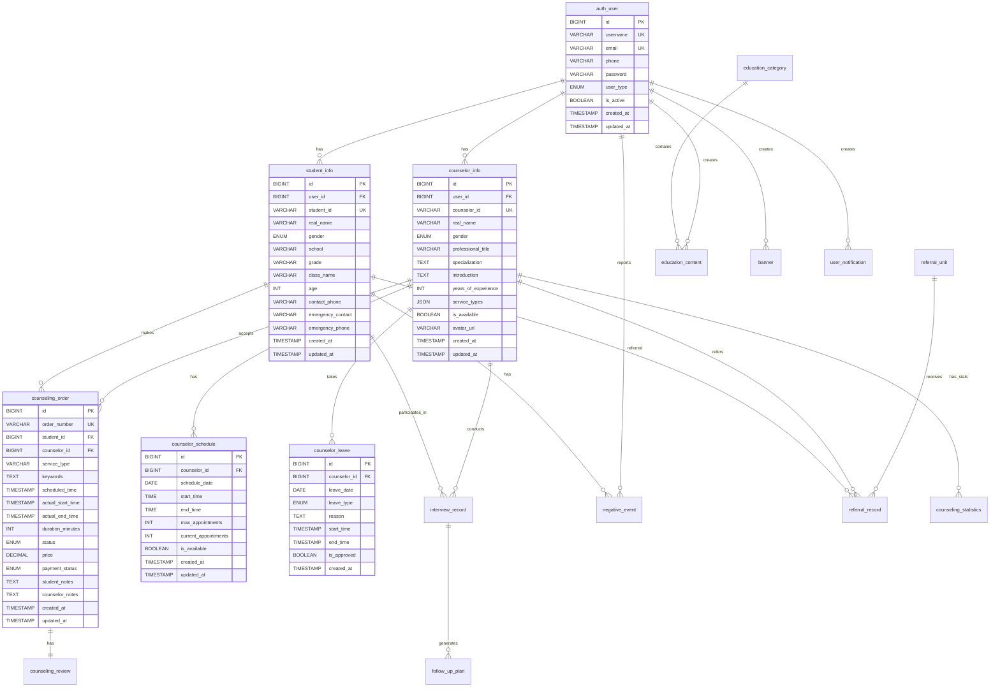
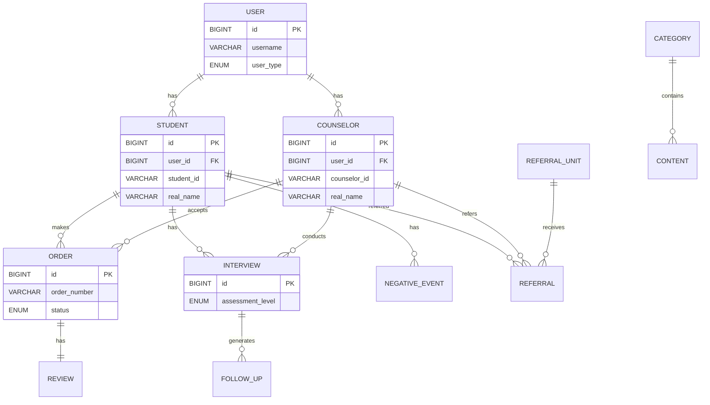

# 数据库配置

本机环境数据库设置参数

```Python
# settings.py
DATABASES = {
    'default': {
        'ENGINE': 'django.db.backends.mysql',
        'NAME': 'counseling_system',
        'USER': 'your_username',
        'PASSWORD': 'your_password',
        'HOST': 'localhost',
        'PORT': '3306',
        'OPTIONS': {
            'charset': 'utf8mb4',
            'init_command': "SET sql_mode='STRICT_TRANS_TABLES'",
        },
        'CONN_MAX_AGE': 300,  # 连接池
    }
}

# 缓存配置
CACHES = {
    'default': {
        'BACKEND': 'django_redis.cache.RedisCache',
        'LOCATION': 'redis://127.0.0.1:6379/1',
        'OPTIONS': {
            'CLIENT_CLASS': 'django_redis.client.DefaultClient',
        }
    }
}
```

# E-R图



## 附：简化关系图




## 附：核心实体关系表

| 主体实体           | 关系类型 | 客体实体          | 关系描述           | 外键字段               |
| ------------------ | -------- | ----------------- | ------------------ | ---------------------- |
| auth_user          | 1:01     | student_info      | 用户拥有学生信息   | user_id                |
| auth_user          | 1:01     | counselor_info    | 用户拥有咨询师信息 | user_id                |
| student_info       | 1:N      | counseling_order  | 学生创建咨询订单   | student_id             |
| counselor_info     | 1:N      | counseling_order  | 咨询师接受咨询订单 | counselor_id           |
| counseling_order   | 1:01     | counseling_review | 订单对应一条评论   | order_id               |
| student_info       | 1:N      | interview_record  | 学生有多次访谈记录 | student_id             |
| counselor_info     | 1:N      | interview_record  | 咨询师进行多次访谈 | counselor_id           |
| interview_record   | 1:N      | follow_up_plan    | 访谈生成后续计划   | interview_id           |
| student_info       | 1:N      | negative_event    | 学生有多个负面事件 | student_id             |
| student_info       | 1:N      | referral_record   | 学生被多次转介     | student_id             |
| counselor_info     | 1:N      | referral_record   | 咨询师进行多次转介 | referring_counselor_id |
| referral_unit      | 1:N      | referral_record   | 单位接收多个转介   | referral_unit_id       |
| education_category | 1:N      | education_content | 栏目包含多个资讯   | category_id            |
| auth_user          | 1:N      | education_content | 用户创建多个资讯   | created_by             |

# 数据库字段设计

## 用户相关表

### 数据库设计

#### auth_user (用户基础表)

| 字段名     | 类型         | 主键 | 索引                 | 允许空 | 默认值            | 参数说明                          |
| ---------- | ------------ | ---- | -------------------- | ------ | ----------------- | --------------------------------- |
| id         | BIGINT       | ✅    | PRIMARY              | ❌      | AUTO_INCREMENT    | 用户唯一ID                        |
| username   | VARCHAR(50)  | ❌    | UNIQUE, idx_username | ❌      | -                 | 用户名，唯一                      |
| email      | VARCHAR(100) | ❌    | UNIQUE               | ✅      | NULL              | 邮箱地址                          |
| phone      | VARCHAR(20)  | ❌    | idx_phone            | ✅      | NULL              | 手机号                            |
| password   | VARCHAR(128) | ❌    | ❌                    | ❌      | -                 | 加密密码                          |
| user_type  | ENUM         | ❌    | idx_user_type        | ❌      | -                 | 用户类型：student/counselor/admin |
| is_active  | BOOLEAN      | ❌    | ❌                    | ❌      | TRUE              | 是否激活                          |
| created_at | TIMESTAMP    | ❌    | ❌                    | ❌      | CURRENT_TIMESTAMP | 创建时间                          |
| updated_at | TIMESTAMP    | ❌    | ❌                    | ❌      | CURRENT_TIMESTAMP | 更新时间                          |

#### student_info (学生信息表)

| 字段名            | 类型         | 主键 | 索引                   | 允许空 | 默认值            | 参数说明                |
| ----------------- | ------------ | ---- | ---------------------- | ------ | ----------------- | ----------------------- |
| id                | BIGINT       | ✅    | PRIMARY                | ❌      | AUTO_INCREMENT    | 学生信息ID              |
| user_id           | BIGINT       | ❌    | FOREIGN                | ❌      | -                 | 关联用户ID              |
| student_id        | VARCHAR(20)  | ❌    | UNIQUE, idx_student_id | ❌      | -                 | 学号，唯一              |
| real_name         | VARCHAR(50)  | ❌    | idx_real_name          | ❌      | -                 | 真实姓名                |
| gender            | ENUM         | ❌    | ❌                      | ❌      | -                 | 性别：male/female/other |
| school            | VARCHAR(100) | ❌    | idx_school_grade       | ✅      | NULL              | 学校名称                |
| grade             | VARCHAR(50)  | ❌    | idx_school_grade       | ✅      | NULL              | 年级                    |
| class_name        | VARCHAR(50)  | ❌    | ❌                      | ✅      | NULL              | 班级名称                |
| age               | INT          | ❌    | ❌                      | ✅      | NULL              | 年龄                    |
| contact_phone     | VARCHAR(20)  | ❌    | ❌                      | ✅      | NULL              | 联系电话                |
| emergency_contact | VARCHAR(50)  | ❌    | ❌                      | ✅      | NULL              | 紧急联系人              |
| emergency_phone   | VARCHAR(20)  | ❌    | ❌                      | ✅      | NULL              | 紧急联系电话            |
| created_at        | TIMESTAMP    | ❌    | ❌                      | ❌      | CURRENT_TIMESTAMP | 创建时间                |
| updated_at        | TIMESTAMP    | ❌    | ❌                      | ❌      | CURRENT_TIMESTAMP | 更新时间                |

#### counselor_info (咨询师信息表)

| 字段名              | 类型         | 主键 | 索引                     | 允许空 | 默认值            | 参数说明                |
| ------------------- | ------------ | ---- | ------------------------ | ------ | ----------------- | ----------------------- |
| id                  | BIGINT       | ✅    | PRIMARY                  | ❌      | AUTO_INCREMENT    | 咨询师信息ID            |
| user_id             | BIGINT       | ❌    | FOREIGN                  | ❌      | -                 | 关联用户ID              |
| counselor_id        | VARCHAR(20)  | ❌    | UNIQUE, idx_counselor_id | ❌      | -                 | 咨询师编号，唯一        |
| real_name           | VARCHAR(50)  | ❌    | idx_real_name            | ❌      | -                 | 真实姓名                |
| gender              | ENUM         | ❌    | ❌                        | ✅      | NULL              | 性别：male/female/other |
| professional_title  | VARCHAR(100) | ❌    | ❌                        | ✅      | NULL              | 专业职称                |
| specialization      | TEXT         | ❌    | ❌                        | ✅      | NULL              | 专业领域                |
| introduction        | TEXT         | ❌    | ❌                        | ✅      | NULL              | 个人介绍                |
| years_of_experience | INT          | ❌    | ❌                        | ✅      | NULL              | 从业年限                |
| service_types       | JSON         | ❌    | ❌                        | ✅      | NULL              | 服务类型数组            |
| is_available        | BOOLEAN      | ❌    | idx_availability         | ❌      | TRUE              | 是否可用                |
| avatar_url          | VARCHAR(200) | ❌    | ❌                        | ✅      | NULL              | 头像URL                 |
| created_at          | TIMESTAMP    | ❌    | ❌                        | ❌      | CURRENT_TIMESTAMP | 创建时间                |
| updated_at          | TIMESTAMP    | ❌    | ❌                        | ❌      | CURRENT_TIMESTAMP | 更新时间                |

### Sql语句

```SQL
-- 用户基础表
CREATE TABLE auth_user (
    id BIGINT AUTO_INCREMENT PRIMARY KEY,
    username VARCHAR(50) NOT NULL UNIQUE,
    email VARCHAR(100) UNIQUE,
    phone VARCHAR(20),
    password VARCHAR(128) NOT NULL,
    user_type ENUM('student', 'counselor', 'admin') NOT NULL,
    is_active BOOLEAN DEFAULT TRUE,
    created_at TIMESTAMP DEFAULT CURRENT_TIMESTAMP,
    updated_at TIMESTAMP DEFAULT CURRENT_TIMESTAMP ON UPDATE CURRENT_TIMESTAMP,
    INDEX idx_username (username),
    INDEX idx_user_type (user_type),
    INDEX idx_phone (phone)
);

-- 学生信息表
CREATE TABLE student_info (
    id BIGINT AUTO_INCREMENT PRIMARY KEY,
    user_id BIGINT NOT NULL,
    student_id VARCHAR(20) NOT NULL UNIQUE,
    real_name VARCHAR(50) NOT NULL,
    gender ENUM('male', 'female', 'other') NOT NULL,
    school VARCHAR(100),
    grade VARCHAR(50),
    class_name VARCHAR(50),
    age INT,
    contact_phone VARCHAR(20),
    emergency_contact VARCHAR(50),
    emergency_phone VARCHAR(20),
    created_at TIMESTAMP DEFAULT CURRENT_TIMESTAMP,
    updated_at TIMESTAMP DEFAULT CURRENT_TIMESTAMP ON UPDATE CURRENT_TIMESTAMP,
    FOREIGN KEY (user_id) REFERENCES auth_user(id) ON DELETE CASCADE,
    INDEX idx_student_id (student_id),
    INDEX idx_school_grade (school, grade),
    INDEX idx_real_name (real_name)
);

-- 咨询师信息表
CREATE TABLE counselor_info (
    id BIGINT AUTO_INCREMENT PRIMARY KEY,
    user_id BIGINT NOT NULL,
    counselor_id VARCHAR(20) NOT NULL UNIQUE,
    real_name VARCHAR(50) NOT NULL,
    gender ENUM('male', 'female', 'other'),
    professional_title VARCHAR(100),
    specialization TEXT,
    introduction TEXT,
    years_of_experience INT,
    service_types JSON, -- 存储服务类型数组
    is_available BOOLEAN DEFAULT TRUE,
    avatar_url VARCHAR(200),
    created_at TIMESTAMP DEFAULT CURRENT_TIMESTAMP,
    updated_at TIMESTAMP DEFAULT CURRENT_TIMESTAMP ON UPDATE CURRENT_TIMESTAMP,
    FOREIGN KEY (user_id) REFERENCES auth_user(id) ON DELETE CASCADE,
    INDEX idx_counselor_id (counselor_id),
    INDEX idx_real_name (real_name),
    INDEX idx_availability (is_available)
);
```

## 咨询管理相关表

### 数据库设计

#### counseling_order (咨询订单表)

| 字段名            | 类型          | 主键 | 索引                          | 允许空 | 默认值            | 参数说明       |
| ----------------- | ------------- | ---- | ----------------------------- | ------ | ----------------- | -------------- |
| id                | BIGINT        | ✅    | PRIMARY                       | ❌      | AUTO_INCREMENT    | 订单ID         |
| order_number      | VARCHAR(32)   | ❌    | UNIQUE, idx_order_number      | ❌      | -                 | 订单号，唯一   |
| student_id        | BIGINT        | ❌    | FOREIGN, idx_student_status   | ❌      | -                 | 学生ID         |
| counselor_id      | BIGINT        | ❌    | FOREIGN, idx_counselor_status | ❌      | -                 | 咨询师ID       |
| service_type      | VARCHAR(50)   | ❌    | ❌                             | ❌      | -                 | 服务类型       |
| keywords          | TEXT          | ❌    | ❌                             | ✅      | NULL              | 咨询关键字     |
| scheduled_time    | TIMESTAMP     | ❌    | idx_scheduled_time            | ❌      | -                 | 预约时间       |
| actual_start_time | TIMESTAMP     | ❌    | ❌                             | ✅      | NULL              | 实际开始时间   |
| actual_end_time   | TIMESTAMP     | ❌    | ❌                             | ✅      | NULL              | 实际结束时间   |
| duration_minutes  | INT           | ❌    | ❌                             | ✅      | NULL              | 咨询时长(分钟) |
| status            | ENUM          | ❌    | idx_status_created            | ❌      | 'pending'         | 订单状态       |
| price             | DECIMAL(10,2) | ❌    | ❌                             | ✅      | NULL              | 价格           |
| payment_status    | ENUM          | ❌    | ❌                             | ❌      | 'unpaid'          | 支付状态       |
| student_notes     | TEXT          | ❌    | ❌                             | ✅      | NULL              | 学生备注       |
| counselor_notes   | TEXT          | ❌    | ❌                             | ✅      | NULL              | 咨询师备注     |
| created_at        | TIMESTAMP     | ❌    | ❌                             | ❌      | CURRENT_TIMESTAMP | 创建时间       |
| updated_at        | TIMESTAMP     | ❌    | ❌                             | ❌      | CURRENT_TIMESTAMP | 更新时间       |

状态说明：

- status: pending/accepted/in_progress/completed/rejected/cancelled
- payment_status: unpaid/paid/refunded

#### counselor_schedule (咨询师排班表)

| 字段名               | 类型      | 主键 | 索引                   | 允许空 | 默认值            | 参数说明   |
| -------------------- | --------- | ---- | ---------------------- | ------ | ----------------- | ---------- |
| id                   | BIGINT    | ✅    | PRIMARY                | ❌      | AUTO_INCREMENT    | 排班ID     |
| counselor_id         | BIGINT    | ❌    | FOREIGN                | ❌      | -                 | 咨询师ID   |
| schedule_date        | DATE      | ❌    | uk_counselor_date_time | ❌      | -                 | 排班日期   |
| start_time           | TIME      | ❌    | uk_counselor_date_time | ❌      | -                 | 开始时间   |
| end_time             | TIME      | ❌    | ❌                      | ❌      | -                 | 结束时间   |
| max_appointments     | INT       | ❌    | ❌                      | ❌      | 5                 | 最大预约数 |
| current_appointments | INT       | ❌    | ❌                      | ❌      | 0                 | 当前预约数 |
| is_available         | BOOLEAN   | ❌    | idx_date_availability  | ❌      | TRUE              | 是否可用   |
| created_at           | TIMESTAMP | ❌    | ❌                      | ❌      | CURRENT_TIMESTAMP | 创建时间   |
| updated_at           | TIMESTAMP | ❌    | ❌                      | ❌      | CURRENT_TIMESTAMP | 更新时间   |

复合唯一键: uk_counselor_date_time (counselor_id, schedule_date, start_time)

#### counselor_leave (停诊安排表)

| 字段名       | 类型      | 主键 | 索引           | 允许空 | 默认值            | 参数说明     |
| ------------ | --------- | ---- | -------------- | ------ | ----------------- | ------------ |
| id           | BIGINT    | ✅    | PRIMARY        | ❌      | AUTO_INCREMENT    | 停诊ID       |
| counselor_id | BIGINT    | ❌    | FOREIGN        | ❌      | -                 | 咨询师ID     |
| leave_date   | DATE      | ❌    | idx_leave_date | ❌      | -                 | 停诊日期     |
| leave_type   | ENUM      | ❌    | ❌              | ❌      | -                 | 停诊类型     |
| reason       | TEXT      | ❌    | ❌              | ✅      | NULL              | 停诊原因     |
| start_time   | TIMESTAMP | ❌    | ❌              | ✅      | NULL              | 停诊开始时间 |
| end_time     | TIMESTAMP | ❌    | ❌              | ✅      | NULL              | 停诊结束时间 |
| is_approved  | BOOLEAN   | ❌    | ❌              | ❌      | TRUE              | 是否批准     |
| created_at   | TIMESTAMP | ❌    | ❌              | ❌      | CURRENT_TIMESTAMP | 创建时间     |

停诊类型: sick/personal/vacation/other

### Sql语句

```SQL
-- 咨询订单表
CREATE TABLE counseling_order (
    id BIGINT AUTO_INCREMENT PRIMARY KEY,
    order_number VARCHAR(32) NOT NULL UNIQUE,
    student_id BIGINT NOT NULL,
    counselor_id BIGINT NOT NULL,
    service_type VARCHAR(50) NOT NULL,
    keywords TEXT, -- 咨询关键字
    scheduled_time TIMESTAMP NOT NULL,
    actual_start_time TIMESTAMP,
    actual_end_time TIMESTAMP,
    duration_minutes INT,
    status ENUM('pending', 'accepted', 'in_progress', 'completed', 'rejected', 'cancelled') DEFAULT 'pending',
    price DECIMAL(10,2),
    payment_status ENUM('unpaid', 'paid', 'refunded') DEFAULT 'unpaid',
    student_notes TEXT,
    counselor_notes TEXT,
    created_at TIMESTAMP DEFAULT CURRENT_TIMESTAMP,
    updated_at TIMESTAMP DEFAULT CURRENT_TIMESTAMP ON UPDATE CURRENT_TIMESTAMP,
    FOREIGN KEY (student_id) REFERENCES student_info(id),
    FOREIGN KEY (counselor_id) REFERENCES counselor_info(id),
    INDEX idx_order_number (order_number),
    INDEX idx_student_status (student_id, status),
    INDEX idx_counselor_status (counselor_id, status),
    INDEX idx_scheduled_time (scheduled_time),
    INDEX idx_status_created (status, created_at)
);

-- 咨询师排班表
CREATE TABLE counselor_schedule (
    id BIGINT AUTO_INCREMENT PRIMARY KEY,
    counselor_id BIGINT NOT NULL,
    schedule_date DATE NOT NULL,
    start_time TIME NOT NULL,
    end_time TIME NOT NULL,
    max_appointments INT DEFAULT 5,
    current_appointments INT DEFAULT 0,
    is_available BOOLEAN DEFAULT TRUE,
    created_at TIMESTAMP DEFAULT CURRENT_TIMESTAMP,
    updated_at TIMESTAMP DEFAULT CURRENT_TIMESTAMP ON UPDATE CURRENT_TIMESTAMP,
    FOREIGN KEY (counselor_id) REFERENCES counselor_info(id),
    UNIQUE KEY uk_counselor_date_time (counselor_id, schedule_date, start_time),
    INDEX idx_date_availability (schedule_date, is_available),
    INDEX idx_counselor_date (counselor_id, schedule_date)
);

-- 停诊安排表
CREATE TABLE counselor_leave (
    id BIGINT AUTO_INCREMENT PRIMARY KEY,
    counselor_id BIGINT NOT NULL,
    leave_date DATE NOT NULL,
    leave_type ENUM('sick', 'personal', 'vacation', 'other') NOT NULL,
    reason TEXT,
    start_time TIMESTAMP,
    end_time TIMESTAMP,
    is_approved BOOLEAN DEFAULT TRUE,
    created_at TIMESTAMP DEFAULT CURRENT_TIMESTAMP,
    FOREIGN KEY (counselor_id) REFERENCES counselor_info(id),
    INDEX idx_leave_date (leave_date),
    INDEX idx_counselor_leave (counselor_id, leave_date)
);
```

## 访谈评估相关表

### 数据库设计

#### interview_record (访谈记录表)

| 字段名                 | 类型        | 主键 | 索引                             | 允许空 | 默认值            | 参数说明   |
| ---------------------- | ----------- | ---- | -------------------------------- | ------ | ----------------- | ---------- |
| id                     | BIGINT      | ✅    | PRIMARY                          | ❌      | AUTO_INCREMENT    | 访谈记录ID |
| student_id             | BIGINT      | ❌    | FOREIGN, idx_student_interview   | ❌      | -                 | 学生ID     |
| counselor_id           | BIGINT      | ❌    | FOREIGN, idx_counselor_interview | ❌      | -                 | 咨询师ID   |
| interview_date         | DATE        | ❌    | idx_completion_status            | ❌      | -                 | 访谈日期   |
| start_time             | TIMESTAMP   | ❌    | ❌                                | ✅      | NULL              | 开始时间   |
| end_time               | TIMESTAMP   | ❌    | ❌                                | ✅      | NULL              | 结束时间   |
| interview_type         | VARCHAR(50) | ❌    | ❌                                | ✅      | NULL              | 访谈类型   |
| assessment_level       | ENUM        | ❌    | ❌                                | ✅      | NULL              | 评估等级   |
| main_issues            | TEXT        | ❌    | ❌                                | ✅      | NULL              | 主要问题   |
| conversation_summary   | TEXT        | ❌    | ❌                                | ✅      | NULL              | 谈话摘要   |
| counselor_observations | TEXT        | ❌    | ❌                                | ✅      | NULL              | 咨询师观察 |
| is_completed           | BOOLEAN     | ❌    | idx_completion_status            | ❌      | FALSE             | 是否完成   |
| completed_at           | TIMESTAMP   | ❌    | ❌                                | ✅      | NULL              | 完成时间   |
| created_at             | TIMESTAMP   | ❌    | ❌                                | ❌      | CURRENT_TIMESTAMP | 创建时间   |
| updated_at             | TIMESTAMP   | ❌    | ❌                                | ❌      | CURRENT_TIMESTAMP | 更新时间   |

评估等级: low/medium/high/critical

#### follow_up_plan (后续计划表)

| 字段名       | 类型      | 主键 | 索引                        | 允许空 | 默认值            | 参数说明   |
| ------------ | --------- | ---- | --------------------------- | ------ | ----------------- | ---------- |
| id           | BIGINT    | ✅    | PRIMARY                     | ❌      | AUTO_INCREMENT    | 计划ID     |
| interview_id | BIGINT    | ❌    | FOREIGN, idx_interview_plan | ❌      | -                 | 访谈记录ID |
| plan_content | TEXT      | ❌    | ❌                           | ❌      | -                 | 计划内容   |
| planned_date | DATE      | ❌    | idx_plan_status             | ✅      | NULL              | 计划日期   |
| priority     | ENUM      | ❌    | ❌                           | ✅      | NULL              | 优先级     |
| status       | ENUM      | ❌    | idx_plan_status             | ❌      | 'pending'         | 状态       |
| assigned_to  | BIGINT    | ❌    | FOREIGN                     | ✅      | NULL              | 分配给     |
| completed_at | TIMESTAMP | ❌    | ❌                           | ✅      | NULL              | 完成时间   |
| created_at   | TIMESTAMP | ❌    | ❌                           | ❌      | CURRENT_TIMESTAMP | 创建时间   |
| updated_at   | TIMESTAMP | ❌    | ❌                           | ❌      | CURRENT_TIMESTAMP | 更新时间   |

优先级: low/medium/high

状态: pending/in_progress/completed/cancelled

#### negative_event (负面事件记录表)

| 字段名             | 类型        | 主键 | 索引                        | 允许空 | 默认值            | 参数说明   |
| ------------------ | ----------- | ---- | --------------------------- | ------ | ----------------- | ---------- |
| id                 | BIGINT      | ✅    | PRIMARY                     | ❌      | AUTO_INCREMENT    | 事件ID     |
| student_id         | BIGINT      | ❌    | FOREIGN, idx_student_events | ❌      | -                 | 学生ID     |
| reporter_id        | BIGINT      | ❌    | FOREIGN                     | ❌      | -                 | 报告人ID   |
| event_date         | DATE        | ❌    | idx_student_events          | ❌      | -                 | 事件日期   |
| event_type         | VARCHAR(50) | ❌    | ❌                           | ❌      | -                 | 事件类型   |
| description        | TEXT        | ❌    | ❌                           | ❌      | -                 | 事件描述   |
| severity_level     | ENUM        | ❌    | idx_event_severity          | ❌      | -                 | 严重程度   |
| actions_taken      | TEXT        | ❌    | ❌                           | ✅      | NULL              | 采取的措施 |
| follow_up_required | BOOLEAN     | ❌    | ❌                           | ❌      | FALSE             | 需要跟进   |
| is_resolved        | BOOLEAN     | ❌    | ❌                           | ❌      | FALSE             | 是否解决   |
| created_at         | TIMESTAMP   | ❌    | ❌                           | ❌      | CURRENT_TIMESTAMP | 创建时间   |
| updated_at         | TIMESTAMP   | ❌    | ❌                           | ❌      | CURRENT_TIMESTAMP | 更新时间   |

严重程度: low/medium/high/critical

### Sql语句

```SQL
-- 访谈记录表
CREATE TABLE interview_record (
    id BIGINT AUTO_INCREMENT PRIMARY KEY,
    student_id BIGINT NOT NULL,
    counselor_id BIGINT NOT NULL,
    interview_date DATE NOT NULL,
    start_time TIMESTAMP,
    end_time TIMESTAMP,
    interview_type VARCHAR(50),
    assessment_level ENUM('low', 'medium', 'high', 'critical'),
    main_issues TEXT,
    conversation_summary TEXT,
    counselor_observations TEXT,
    is_completed BOOLEAN DEFAULT FALSE,
    completed_at TIMESTAMP,
    created_at TIMESTAMP DEFAULT CURRENT_TIMESTAMP,
    updated_at TIMESTAMP DEFAULT CURRENT_TIMESTAMP ON UPDATE CURRENT_TIMESTAMP,
    FOREIGN KEY (student_id) REFERENCES student_info(id),
    FOREIGN KEY (counselor_id) REFERENCES counselor_info(id),
    INDEX idx_student_interview (student_id, interview_date),
    INDEX idx_counselor_interview (counselor_id, interview_date),
    INDEX idx_completion_status (is_completed, interview_date)
);

-- 后续计划表
CREATE TABLE follow_up_plan (
    id BIGINT AUTO_INCREMENT PRIMARY KEY,
    interview_id BIGINT NOT NULL,
    plan_content TEXT NOT NULL,
    planned_date DATE,
    priority ENUM('low', 'medium', 'high'),
    status ENUM('pending', 'in_progress', 'completed', 'cancelled') DEFAULT 'pending',
    assigned_to BIGINT, -- 咨询师ID
    completed_at TIMESTAMP,
    created_at TIMESTAMP DEFAULT CURRENT_TIMESTAMP,
    updated_at TIMESTAMP DEFAULT CURRENT_TIMESTAMP ON UPDATE CURRENT_TIMESTAMP,
    FOREIGN KEY (interview_id) REFERENCES interview_record(id) ON DELETE CASCADE,
    FOREIGN KEY (assigned_to) REFERENCES counselor_info(id),
    INDEX idx_interview_plan (interview_id),
    INDEX idx_plan_status (status, planned_date)
);

-- 负面事件记录表
CREATE TABLE negative_event (
    id BIGINT AUTO_INCREMENT PRIMARY KEY,
    student_id BIGINT NOT NULL,
    reporter_id BIGINT NOT NULL, -- 报告人ID
    event_date DATE NOT NULL,
    event_type VARCHAR(50) NOT NULL,
    description TEXT NOT NULL,
    severity_level ENUM('low', 'medium', 'high', 'critical') NOT NULL,
    actions_taken TEXT,
    follow_up_required BOOLEAN DEFAULT FALSE,
    is_resolved BOOLEAN DEFAULT FALSE,
    created_at TIMESTAMP DEFAULT CURRENT_TIMESTAMP,
    updated_at TIMESTAMP DEFAULT CURRENT_TIMESTAMP ON UPDATE CURRENT_TIMESTAMP,
    FOREIGN KEY (student_id) REFERENCES student_info(id),
    FOREIGN KEY (reporter_id) REFERENCES auth_user(id),
    INDEX idx_student_events (student_id, event_date),
    INDEX idx_event_severity (severity_level, event_date)
);
```

## 转介管理相关表

### 数据库设计

#### referral_unit (转介单位表)

| 字段名         | 类型         | 主键 | 索引                  | 允许空 | 默认值            | 参数说明       |
| -------------- | ------------ | ---- | --------------------- | ------ | ----------------- | -------------- |
| id             | BIGINT       | ✅    | PRIMARY               | ❌      | AUTO_INCREMENT    | 单位ID         |
| unit_name      | VARCHAR(100) | ❌    | UNIQUE, idx_unit_name | ❌      | -                 | 单位名称，唯一 |
| unit_type      | VARCHAR(50)  | ❌    | idx_unit_type         | ✅      | NULL              | 单位类型       |
| contact_person | VARCHAR(50)  | ❌    | ❌                     | ✅      | NULL              | 联系人         |
| contact_phone  | VARCHAR(20)  | ❌    | ❌                     | ✅      | NULL              | 联系电话       |
| address        | TEXT         | ❌    | ❌                     | ✅      | NULL              | 地址           |
| specialties    | TEXT         | ❌    | ❌                     | ✅      | NULL              | 专业领域       |
| is_active      | BOOLEAN      | ❌    | ❌                     | ❌      | TRUE              | 是否激活       |
| created_at     | TIMESTAMP    | ❌    | ❌                     | ❌      | CURRENT_TIMESTAMP | 创建时间       |
| updated_at     | TIMESTAMP    | ❌    | ❌                     | ❌      | CURRENT_TIMESTAMP | 更新时间       |

#### referral_record (转介记录表)

| 字段名                    | 类型      | 主键 | 索引                          | 允许空 | 默认值            | 参数说明     |
| ------------------------- | --------- | ---- | ----------------------------- | ------ | ----------------- | ------------ |
| id                        | BIGINT    | ✅    | PRIMARY                       | ❌      | AUTO_INCREMENT    | 转介记录ID   |
| student_id                | BIGINT    | ❌    | FOREIGN, idx_student_referral | ❌      | -                 | 学生ID       |
| referring_counselor_id    | BIGINT    | ❌    | FOREIGN                       | ❌      | -                 | 转介咨询师ID |
| referral_unit_id          | BIGINT    | ❌    | FOREIGN                       | ❌      | -                 | 转介单位ID   |
| referral_date             | DATE      | ❌    | idx_referral_status           | ❌      | -                 | 转介日期     |
| referral_reason           | TEXT      | ❌    | ❌                             | ❌      | -                 | 转介原因     |
| student_condition_summary | TEXT      | ❌    | ❌                             | ✅      | NULL              | 学生情况摘要 |
| expected_support          | TEXT      | ❌    | ❌                             | ✅      | NULL              | 期望支持     |
| status                    | ENUM      | ❌    | idx_referral_status           | ❌      | 'pending'         | 转介状态     |
| feedback_from_unit        | TEXT      | ❌    | ❌                             | ✅      | NULL              | 单位反馈     |
| follow_up_notes           | TEXT      | ❌    | ❌                             | ✅      | NULL              | 跟进备注     |
| created_at                | TIMESTAMP | ❌    | ❌                             | ❌      | CURRENT_TIMESTAMP | 创建时间     |
| updated_at                | TIMESTAMP | ❌    | ❌                             | ❌      | CURRENT_TIMESTAMP | 更新时间     |

转介状态: pending/accepted/in_progress/completed/rejected

### Sql语句

```SQL
-- 转介单位表
CREATE TABLE referral_unit (
    id BIGINT AUTO_INCREMENT PRIMARY KEY,
    unit_name VARCHAR(100) NOT NULL UNIQUE,
    unit_type VARCHAR(50),
    contact_person VARCHAR(50),
    contact_phone VARCHAR(20),
    address TEXT,
    specialties TEXT,
    is_active BOOLEAN DEFAULT TRUE,
    created_at TIMESTAMP DEFAULT CURRENT_TIMESTAMP,
    updated_at TIMESTAMP DEFAULT CURRENT_TIMESTAMP ON UPDATE CURRENT_TIMESTAMP,
    INDEX idx_unit_name (unit_name),
    INDEX idx_unit_type (unit_type)
);

-- 转介记录表
CREATE TABLE referral_record (
    id BIGINT AUTO_INCREMENT PRIMARY KEY,
    student_id BIGINT NOT NULL,
    referring_counselor_id BIGINT NOT NULL,
    referral_unit_id BIGINT NOT NULL,
    referral_date DATE NOT NULL,
    referral_reason TEXT NOT NULL,
    student_condition_summary TEXT,
    expected_support TEXT,
    status ENUM('pending', 'accepted', 'in_progress', 'completed', 'rejected') DEFAULT 'pending',
    feedback_from_unit TEXT,
    follow_up_notes TEXT,
    created_at TIMESTAMP DEFAULT CURRENT_TIMESTAMP,
    updated_at TIMESTAMP DEFAULT CURRENT_TIMESTAMP ON UPDATE CURRENT_TIMESTAMP,
    FOREIGN KEY (student_id) REFERENCES student_info(id),
    FOREIGN KEY (referring_counselor_id) REFERENCES counselor_info(id),
    FOREIGN KEY (referral_unit_id) REFERENCES referral_unit(id),
    INDEX idx_student_referral (student_id, referral_date),
    INDEX idx_referral_status (status, referral_date)
);
```

## 内容管理相关表

### 数据库设计

#### education_category (宣教栏目表)

| 字段名        | 类型         | 主键 | 索引                | 允许空 | 默认值            | 参数说明       |
| ------------- | ------------ | ---- | ------------------- | ------ | ----------------- | -------------- |
| id            | BIGINT       | ✅    | PRIMARY             | ❌      | AUTO_INCREMENT    | 栏目ID         |
| category_name | VARCHAR(100) | ❌    | UNIQUE              | ❌      | -                 | 栏目名称，唯一 |
| description   | TEXT         | ❌    | ❌                   | ✅      | NULL              | 栏目描述       |
| sort_order    | INT          | ❌    | idx_category_order  | ❌      | 0                 | 排序顺序       |
| is_active     | BOOLEAN      | ❌    | idx_category_active | ❌      | TRUE              | 是否激活       |
| created_at    | TIMESTAMP    | ❌    | ❌                   | ❌      | CURRENT_TIMESTAMP | 创建时间       |
| updated_at    | TIMESTAMP    | ❌    | ❌                   | ❌      | CURRENT_TIMESTAMP | 更新时间       |

#### education_content (宣教资讯表)

| 字段名       | 类型         | 主键 | 索引                            | 允许空 | 默认值            | 参数说明 |
| ------------ | ------------ | ---- | ------------------------------- | ------ | ----------------- | -------- |
| id           | BIGINT       | ✅    | PRIMARY                         | ❌      | AUTO_INCREMENT    | 资讯ID   |
| category_id  | BIGINT       | ❌    | FOREIGN, idx_category_published | ❌      | -                 | 栏目ID   |
| title        | VARCHAR(200) | ❌    | FULLTEXT                        | ❌      | -                 | 标题     |
| content      | LONGTEXT     | ❌    | FULLTEXT                        | ✅      | NULL              | 内容     |
| summary      | TEXT         | ❌    | FULLTEXT                        | ✅      | NULL              | 摘要     |
| author       | VARCHAR(50)  | ❌    | ❌                               | ✅      | NULL              | 作者     |
| cover_image  | VARCHAR(200) | ❌    | ❌                               | ✅      | NULL              | 封面图片 |
| view_count   | INT          | ❌    | ❌                               | ❌      | 0                 | 浏览次数 |
| is_published | BOOLEAN      | ❌    | idx_category_published          | ❌      | FALSE             | 是否发布 |
| publish_time | TIMESTAMP    | ❌    | idx_publish_time                | ✅      | NULL              | 发布时间 |
| created_by   | BIGINT       | ❌    | FOREIGN                         | ❌      | -                 | 创建人   |
| created_at   | TIMESTAMP    | ❌    | ❌                               | ❌      | CURRENT_TIMESTAMP | 创建时间 |
| updated_at   | TIMESTAMP    | ❌    | ❌                               | ❌      | CURRENT_TIMESTAMP | 更新时间 |

全文索引: idx_content_search (title, content, summary)

#### banner (Banner轮播图表)

| 字段名     | 类型         | 主键 | 索引              | 允许空 | 默认值            | 参数说明  |
| ---------- | ------------ | ---- | ----------------- | ------ | ----------------- | --------- |
| id         | BIGINT       | ✅    | PRIMARY           | ❌      | AUTO_INCREMENT    | Banner ID |
| title      | VARCHAR(100) | ❌    | ❌                 | ❌      | -                 | 标题      |
| image_url  | VARCHAR(200) | ❌    | ❌                 | ❌      | -                 | 图片URL   |
| link_url   | VARCHAR(200) | ❌    | ❌                 | ✅      | NULL              | 链接URL   |
| sort_order | INT          | ❌    | idx_banner_order  | ❌      | 0                 | 排序顺序  |
| is_active  | BOOLEAN      | ❌    | idx_banner_active | ❌      | TRUE              | 是否激活  |
| start_time | TIMESTAMP    | ❌    | idx_banner_active | ✅      | NULL              | 开始时间  |
| end_time   | TIMESTAMP    | ❌    | idx_banner_active | ✅      | NULL              | 结束时间  |
| created_by | BIGINT       | ❌    | FOREIGN           | ❌      | -                 | 创建人    |
| created_at | TIMESTAMP    | ❌    | ❌                 | ❌      | CURRENT_TIMESTAMP | 创建时间  |
| updated_at | TIMESTAMP    | ❌    | ❌                 | ❌      | CURRENT_TIMESTAMP | 更新时间  |

#### user_notification (用户通知表)

| 字段名            | 类型         | 主键 | 索引                     | 允许空 | 默认值            | 参数说明 |
| ----------------- | ------------ | ---- | ------------------------ | ------ | ----------------- | -------- |
| id                | BIGINT       | ✅    | PRIMARY                  | ❌      | AUTO_INCREMENT    | 通知ID   |
| title             | VARCHAR(200) | ❌    | ❌                        | ❌      | -                 | 标题     |
| content           | TEXT         | ❌    | ❌                        | ❌      | -                 | 内容     |
| notification_type | VARCHAR(50)  | ❌    | idx_audience_type        | ✅      | NULL              | 通知类型 |
| target_audience   | ENUM         | ❌    | idx_audience_type        | ❌      | 'all'             | 目标受众 |
| is_published      | BOOLEAN      | ❌    | idx_notification_publish | ❌      | FALSE             | 是否发布 |
| publish_time      | TIMESTAMP    | ❌    | idx_notification_publish | ✅      | NULL              | 发布时间 |
| created_by        | BIGINT       | ❌    | FOREIGN                  | ❌      | -                 | 创建人   |
| created_at        | TIMESTAMP    | ❌    | ❌                        | ❌      | CURRENT_TIMESTAMP | 创建时间 |
| updated_at        | TIMESTAMP    | ❌    | ❌                        | ❌      | CURRENT_TIMESTAMP | 更新时间 |

目标受众: all/students/counselors/admins

### Sql语句

```SQL
-- 宣教栏目表
CREATE TABLE education_category (
    id BIGINT AUTO_INCREMENT PRIMARY KEY,
    category_name VARCHAR(100) NOT NULL UNIQUE,
    description TEXT,
    sort_order INT DEFAULT 0,
    is_active BOOLEAN DEFAULT TRUE,
    created_at TIMESTAMP DEFAULT CURRENT_TIMESTAMP,
    updated_at TIMESTAMP DEFAULT CURRENT_TIMESTAMP ON UPDATE CURRENT_TIMESTAMP,
    INDEX idx_category_order (sort_order),
    INDEX idx_category_active (is_active)
);

-- 宣教资讯表
CREATE TABLE education_content (
    id BIGINT AUTO_INCREMENT PRIMARY KEY,
    category_id BIGINT NOT NULL,
    title VARCHAR(200) NOT NULL,
    content LONGTEXT,
    summary TEXT,
    author VARCHAR(50),
    cover_image VARCHAR(200),
    view_count INT DEFAULT 0,
    is_published BOOLEAN DEFAULT FALSE,
    publish_time TIMESTAMP,
    created_by BIGINT NOT NULL,
    created_at TIMESTAMP DEFAULT CURRENT_TIMESTAMP,
    updated_at TIMESTAMP DEFAULT CURRENT_TIMESTAMP ON UPDATE CURRENT_TIMESTAMP,
    FOREIGN KEY (category_id) REFERENCES education_category(id),
    FOREIGN KEY (created_by) REFERENCES auth_user(id),
    INDEX idx_category_published (category_id, is_published, publish_time),
    INDEX idx_publish_time (publish_time),
    FULLTEXT idx_content_search (title, content, summary)
);

-- Banner轮播图表
CREATE TABLE banner (
    id BIGINT AUTO_INCREMENT PRIMARY KEY,
    title VARCHAR(100) NOT NULL,
    image_url VARCHAR(200) NOT NULL,
    link_url VARCHAR(200),
    sort_order INT DEFAULT 0,
    is_active BOOLEAN DEFAULT TRUE,
    start_time TIMESTAMP,
    end_time TIMESTAMP,
    created_by BIGINT NOT NULL,
    created_at TIMESTAMP DEFAULT CURRENT_TIMESTAMP,
    updated_at TIMESTAMP DEFAULT CURRENT_TIMESTAMP ON UPDATE CURRENT_TIMESTAMP,
    FOREIGN KEY (created_by) REFERENCES auth_user(id),
    INDEX idx_banner_active (is_active, start_time, end_time),
    INDEX idx_banner_order (sort_order)
);

-- 用户通知表
CREATE TABLE user_notification (
    id BIGINT AUTO_INCREMENT PRIMARY KEY,
    title VARCHAR(200) NOT NULL,
    content TEXT NOT NULL,
    notification_type VARCHAR(50),
    target_audience ENUM('all', 'students', 'counselors', 'admins') DEFAULT 'all',
    is_published BOOLEAN DEFAULT FALSE,
    publish_time TIMESTAMP,
    created_by BIGINT NOT NULL,
    created_at TIMESTAMP DEFAULT CURRENT_TIMESTAMP,
    updated_at TIMESTAMP DEFAULT CURRENT_TIMESTAMP ON UPDATE CURRENT_TIMESTAMP,
    FOREIGN KEY (created_by) REFERENCES auth_user(id),
    INDEX idx_notification_publish (is_published, publish_time),
    INDEX idx_audience_type (target_audience, notification_type)
);
```

## 评论统计相关表

### 数据库设计

#### counseling_review (咨询评论表)

| 字段名       | 类型      | 主键 | 索引                          | 允许空 | 默认值            | 参数说明     |
| ------------ | --------- | ---- | ----------------------------- | ------ | ----------------- | ------------ |
| id           | BIGINT    | ✅    | PRIMARY                       | ❌      | AUTO_INCREMENT    | 评论ID       |
| order_id     | BIGINT    | ❌    | UNIQUE, idx_order_review      | ❌      | -                 | 订单ID，唯一 |
| student_id   | BIGINT    | ❌    | FOREIGN                       | ❌      | -                 | 学生ID       |
| counselor_id | BIGINT    | ❌    | FOREIGN, idx_counselor_rating | ❌      | -                 | 咨询师ID     |
| rating       | TINYINT   | ❌    | idx_counselor_rating          | ❌      | -                 | 评分(1-5)    |
| comment      | TEXT      | ❌    | ❌                             | ✅      | NULL              | 评论内容     |
| is_anonymous | BOOLEAN   | ❌    | ❌                             | ❌      | FALSE             | 是否匿名     |
| is_approved  | BOOLEAN   | ❌    | ❌                             | ❌      | TRUE              | 是否审核通过 |
| created_at   | TIMESTAMP | ❌    | ❌                             | ❌      | CURRENT_TIMESTAMP | 创建时间     |
| updated_at   | TIMESTAMP | ❌    | ❌                             | ❌      | CURRENT_TIMESTAMP | 更新时间     |

#### counseling_statistics (咨询统计表)

| 字段名           | 类型          | 主键 | 索引                         | 允许空 | 默认值            | 参数说明   |
| ---------------- | ------------- | ---- | ---------------------------- | ------ | ----------------- | ---------- |
| id               | BIGINT        | ✅    | PRIMARY                      | ❌      | AUTO_INCREMENT    | 统计ID     |
| statistic_date   | DATE          | ❌    | uk_date_counselor            | ❌      | -                 | 统计日期   |
| counselor_id     | BIGINT        | ❌    | FOREIGN, idx_counselor_stats | ✅      | NULL              | 咨询师ID   |
| total_orders     | INT           | ❌    | ❌                            | ❌      | 0                 | 总订单数   |
| completed_orders | INT           | ❌    | ❌                            | ❌      | 0                 | 完成订单数 |
| cancelled_orders | INT           | ❌    | ❌                            | ❌      | 0                 | 取消订单数 |
| total_revenue    | DECIMAL(12,2) | ❌    | ❌                            | ❌      | 0                 | 总收入     |
| average_rating   | DECIMAL(3,2)  | ❌    | ❌                            | ❌      | 0                 | 平均评分   |
| total_reviews    | INT           | ❌    | ❌                            | ❌      | 0                 | 总评论数   |
| created_at       | TIMESTAMP     | ❌    | ❌                            | ❌      | CURRENT_TIMESTAMP | 创建时间   |
| updated_at       | TIMESTAMP     | ❌    | ❌                            | ❌      | CURRENT_TIMESTAMP | 更新时间   |

复合唯一键: uk_date_counselor (statistic_date, counselor_id)

### Sql语句

```SQL
-- 咨询评论表
CREATE TABLE counseling_review (
    id BIGINT AUTO_INCREMENT PRIMARY KEY,
    order_id BIGINT NOT NULL UNIQUE,
    student_id BIGINT NOT NULL,
    counselor_id BIGINT NOT NULL,
    rating TINYINT NOT NULL CHECK (rating >= 1 AND rating <= 5),
    comment TEXT,
    is_anonymous BOOLEAN DEFAULT FALSE,
    is_approved BOOLEAN DEFAULT TRUE,
    created_at TIMESTAMP DEFAULT CURRENT_TIMESTAMP,
    updated_at TIMESTAMP DEFAULT CURRENT_TIMESTAMP ON UPDATE CURRENT_TIMESTAMP,
    FOREIGN KEY (order_id) REFERENCES counseling_order(id),
    FOREIGN KEY (student_id) REFERENCES student_info(id),
    FOREIGN KEY (counselor_id) REFERENCES counselor_info(id),
    INDEX idx_counselor_rating (counselor_id, rating),
    INDEX idx_order_review (order_id)
);

-- 咨询统计表（用于快速查询）
CREATE TABLE counseling_statistics (
    id BIGINT AUTO_INCREMENT PRIMARY KEY,
    statistic_date DATE NOT NULL,
    counselor_id BIGINT,
    total_orders INT DEFAULT 0,
    completed_orders INT DEFAULT 0,
    cancelled_orders INT DEFAULT 0,
    total_revenue DECIMAL(12,2) DEFAULT 0,
    average_rating DECIMAL(3,2) DEFAULT 0,
    total_reviews INT DEFAULT 0,
    created_at TIMESTAMP DEFAULT CURRENT_TIMESTAMP,
    updated_at TIMESTAMP DEFAULT CURRENT_TIMESTAMP ON UPDATE CURRENT_TIMESTAMP,
    FOREIGN KEY (counselor_id) REFERENCES counselor_info(id),
    UNIQUE KEY uk_date_counselor (statistic_date, counselor_id),
    INDEX idx_statistic_date (statistic_date),
    INDEX idx_counselor_stats (counselor_id, statistic_date)
);
```